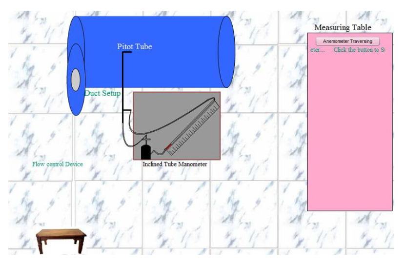
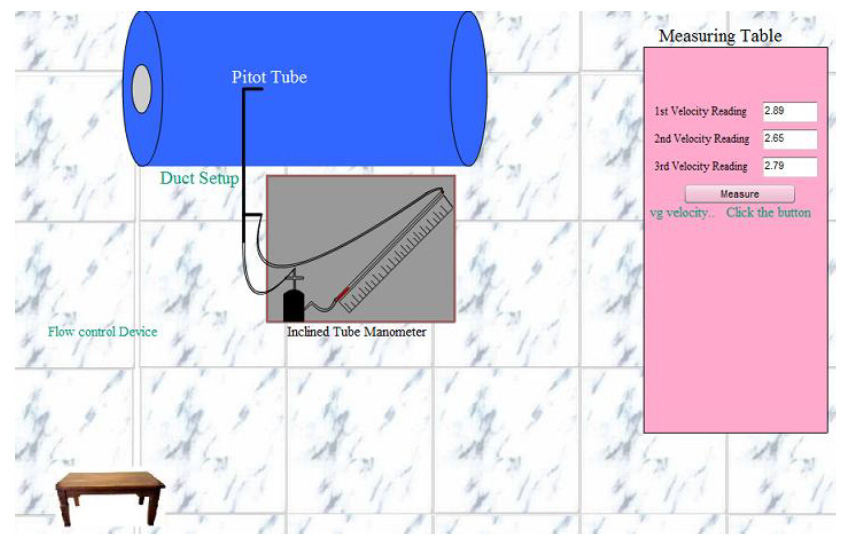
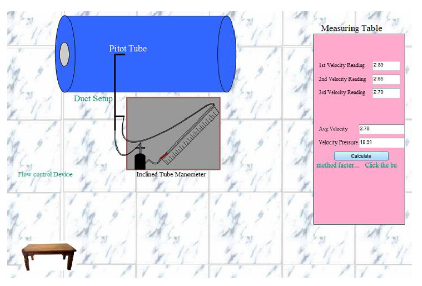
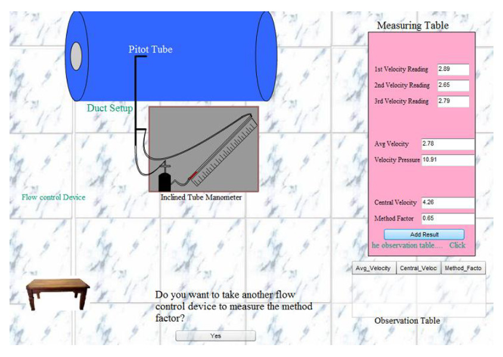
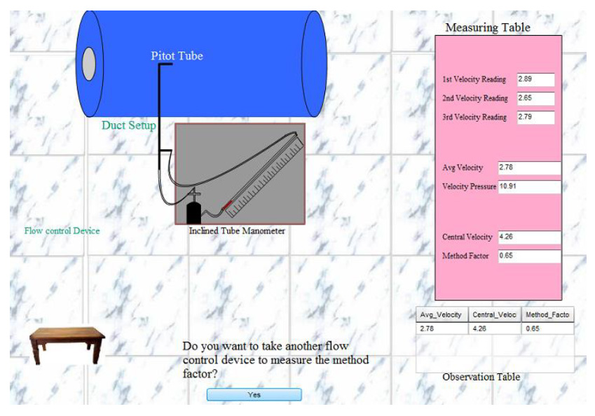
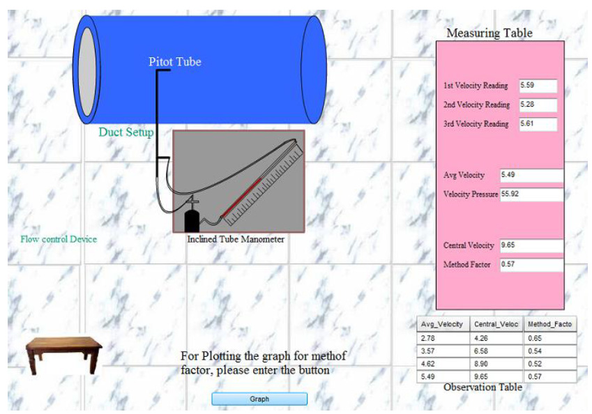
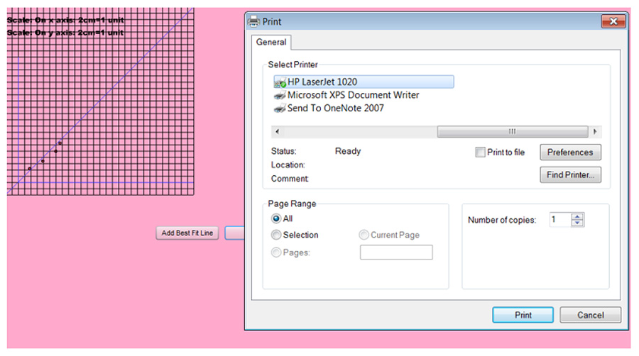

## Procedure
- Place the pitot tube at the centre of the duct and connect the total pressure and static pressure ends to an inclined tube manometer to obtain velocity pressure.
- Start the fan.
- Measure the average velocity by traversing the anemometer.
- Find the central velocity from the velocity pressure measured with inclined tube manometer.
- Estimate the method factor by dividing the average velocity and the central velocity.

## Simulation Procedure

The following procedure is to be followed by the user in order to determine the method factor of a duct:

1. Start the Experiment by click on the button "Start Experiment".

2. Put the diameter value in the given input box and then click on the button "Yes" (the range of the diameter value is 0.5m to 0.6m).

3. After that click on the flow control device to start the experiment and take the readings.

4. After that click on the button "Anemometer Traversing" measuring the air flow in the duct.

5. Then click on the button "Measure" to measure the average velocity and the pressure velocity.

6. After that click on the button "Calculate" to calculate the central velocity and the method factor of the duct.

7. Then for add the result to the observation table.

8. Do the same process for different flow of air by regulating the air flow in the duct.

9. Then for graph click on the "Graph" button.

10. After that add the best fit line and print the graph by clicking on the button "Print".

